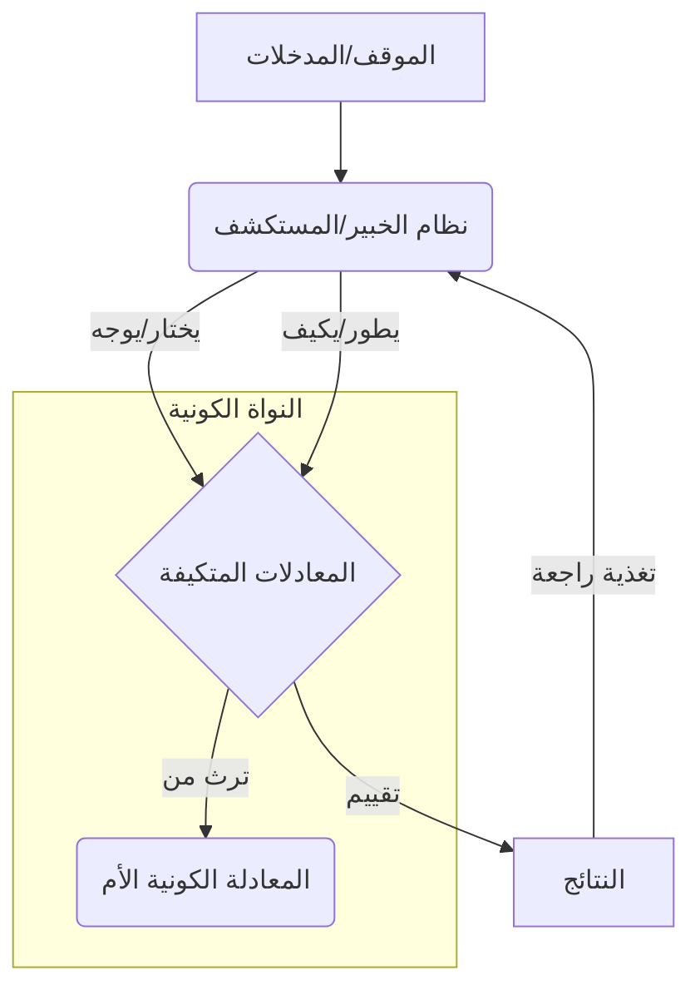

# الأسس الفلسفية والرياضية لنظام بصيرة الثوري
# Philosophical and Mathematical Foundations of the Basira Revolutionary System

## 🌟 مقدمة: نحو ذكاء اصطناعي جديد
## 🌟 Introduction: Towards a New Artificial Intelligence

يمثل نظام بصيرة نقلة نوعية في فهم وتصميم الذكاء الاصطناعي، حيث يتجاوز النماذج التقليدية القائمة على الشبكات العصبية والتعلم العميق، ويقدم نموذجاً ثورياً يعتمد على **المعادلات الرياضية المتكيفة** و**نموذج الخبير/المستكشف** ومبادئ **الذكاء الاصطناعي الكائني (AI-OOP)**. هذه الوثيقة تستعرض الأسس الفلسفية والرياضية العميقة التي يقوم عليها هذا النظام، وكيف تتجسد هذه الأسس في هيكليته ووحداته المختلفة.

## 🌌 المعادلة الكونية الأم: جوهر الوجود الرياضي
## 🌌 The Universal Equation: The Essence of Mathematical Existence

في قلب نظام بصيرة تكمن **المعادلة الكونية الأم (Universal Equation - UE)**. هذه المعادلة ليست مجرد صيغة رياضية ثابتة، بل هي **بنية رياضية ديناميكية وقابلة للتكيف** تمثل الأساس الذي يمكن من خلاله اشتقاق وتوليد جميع المعادلات الأخرى في النظام. إنها تجسيد لفكرة أن الكون، بكل تعقيداته وتنوعه، يمكن تمثيله وفهمه من خلال مبادئ رياضية موحدة وقابلة للتطور.

**الخصائص الأساسية للمعادلة الكونية الأم:**

1.  **الشمولية (Universality)**: قادرة على تمثيل أي مفهوم أو ظاهرة أو شكل، سواء كان رياضياً، فيزيائياً، لغوياً، أو حتى نفسياً.
2.  **التكيفية (Adaptability)**: قادرة على تعديل معالمها وبنيتها الداخلية استجابةً للمدخلات والتغذية الراجعة، مما يسمح لها بالتعلم والتطور.
3.  **الوراثة الموحدة (Unified Inheritance)**: تعمل كأساس ترث منه جميع المعادلات المتخصصة الأخرى، مما يضمن التناسق والتكامل في النظام (مبدأ AI-OOP).
4.  **المكونات الديناميكية (Dynamic Components)**: تتكون من مكونات رياضية أساسية يمكن إعادة ترتيبها وتعديلها لتوليد معادلات جديدة.
5.  **البيانات الوصفية (Metadata)**: تحمل كل معادلة بيانات وصفية غنية تشرح أصلها، تطورها، خصائصها، وعلاقاتها بالمعادلات الأخرى.

**التجسيد الرياضي (مبسط):**

```python
class UniversalEquation:
    def __init__(self, parameters=None, metadata=None, components=None):
        self.parameters = parameters or {}
        self.metadata = metadata or EquationMetadata()
        self.components = components or [] # مكونات رياضية أساسية
        self.evolution_history = []

    def evaluate(self, input_data):
        # تقييم المعادلة بناءً على مكوناتها ومعلماتها
        result = self._apply_components(input_data)
        return result

    def adapt(self, feedback):
        # تعديل المعلمات والمكونات بناءً على التغذية الراجعة
        self._update_parameters(feedback)
        self._restructure_components(feedback)
        self.metadata.update_adaptation_log(feedback)

    def evolve(self, evolution_strategy):
        # تطبيق استراتيجية تطور لتوليد معادلات جديدة أو محسنة
        new_equation = evolution_strategy.apply(self)
        self.evolution_history.append(new_equation)
        return new_equation

    def _apply_components(self, data):
        # تطبيق المكونات الرياضية بالتسلسل أو التوازي
        pass

    def _update_parameters(self, feedback):
        # تحديث قيم المعلمات
        pass

    def _restructure_components(self, feedback):
        # إضافة أو إزالة أو تعديل المكونات
        pass
```

## 🧬 الذكاء الاصطناعي الكائني (AI-OOP): بناء النظام كوحدة متكاملة
## 🧬 AI-Object Oriented Programming (AI-OOP): Building the System as an Integrated Unit

يعتمد نظام بصيرة على مبادئ **الذكاء الاصطناعي الكائني (AI-OOP)**، وهي فلسفة تصميم تهدف إلى بناء أنظمة ذكاء اصطناعي متكاملة ومترابطة، بدلاً من مجموعة من الوحدات المنفصلة. تتجسد هذه الفلسفة من خلال:

1.  **الوراثة الموحدة من المعادلة الكونية**: جميع المعادلات والوحدات في النظام ترث بشكل مباشر أو غير مباشر من المعادلة الكونية الأم، مما يضمن أساساً رياضياً وفلسفياً موحداً.
2.  **عدم التكرار (Don't Repeat Yourself - DRY)**: يتم تعريف المفاهيم والوظائف الأساسية مرة واحدة في الوحدات الأم (مثل المعادلة الكونية)، وترثها الوحدات المتخصصة، مما يقلل التكرار ويزيد التناسق.
3.  **التغليف (Encapsulation)**: كل وحدة (مثل معادلة الشكل العام أو نظام الخبير) تغلف وظائفها وبياناتها الداخلية، وتوفر واجهة واضحة للتفاعل مع الوحدات الأخرى.
4.  **تعدد الأوجه (Polymorphism)**: يمكن للوحدات المختلفة أن تستجيب لنفس الرسالة (مثل `evaluate` أو `adapt`) بطرق مختلفة تتناسب مع تخصصها، مع الحفاظ على واجهة موحدة.
5.  **التكامل العميق**: لا تعمل الوحدات بشكل منعزل، بل تتفاعل وتتكامل بشكل عميق من خلال آليات مثل حلقة التغذية الراجعة ونقل المعرفة في نظام الخبير/المستكشف.

**كيف تتجسد AI-OOP في الهيكلية:**

- **`cosmic_core`**: يمثل الأساس الكائني الذي يحتوي على الكلاس الأم (`UniversalEquation`) والمبادئ الأساسية.
- **الوحدات المتخصصة** (مثل `adaptive_equations`, `symbolic_processing`): ترث وتخصص الوظائف من النواة الكونية.
- **`expert_explorer`**: يمثل العقل المدبر الذي ينسق التفاعل بين الكائنات (الوحدات) المختلفة.
- **`integration`**: يوفر آليات لربط وتكامل الكائنات المختلفة في النظام.

## 🧠 نظام الخبير/المستكشف: العقل الديناميكي للنظام
## 🧠 Expert-Explorer System: The Dynamic Mind of the System

إذا كانت المعادلة الكونية تمثل **الجسد الرياضي** للنظام، فإن نظام الخبير/المستكشف يمثل **العقل الديناميكي** الذي يقود عمليات التعلم والتطور والاستكشاف. يتكامل هذا النظام بشكل عميق مع المعادلة الكونية:

1.  **الخبير يوجه المعادلات**: يستخدم الخبير (`ExpertSystem`) المعرفة المتراكمة لتحديد أي المعادلات يجب استخدامها، وكيفية تعديل معلماتها (`adapt`) لمواجهة موقف معين.
2.  **المستكشف يطور المعادلات**: يقوم المستكشف (`ExplorerSystem`) باستكشاف فضاء الحلول الممكنة، ويقترح تعديلات هيكلية على المعادلات أو يولد معادلات جديدة (`evolve`) لتحسين الأداء أو اكتشاف إمكانيات جديدة.
3.  **المعادلات توفر الأساس**: توفر المعادلات المتكيفة (التي ترث من المعادلة الكونية) البنية الرياضية التي يعمل عليها الخبير والمستكشف. قرارات الخبير واستكشافات المستكشف تؤدي إلى تكييف وتطوير هذه المعادلات.
4.  **حلقة التغذية الراجعة**: تربط حلقة التغذية الراجعة بين نتائج تقييم المعادلات (`evaluate`) وقرارات الخبير واستكشافات المستكشف، مما يضمن دورة تعلم وتطور مستمرة.

**العلاقة التفاعلية:**



## 💡 تجسيد الفلسفة في الوحدات
## 💡 Embodying the Philosophy in Units

تتجلى هذه الأسس الفلسفية والرياضية في كل وحدة من وحدات نظام بصيرة:

- **المعادلات المتكيفة (`adaptive_equations`)**: التطبيق المباشر للمعادلة الكونية في التعلم والتكيف، مع التركيز على معادلة الشكل العام وتطور المعادلات.
- **المعالجة الرمزية (`symbolic_processing`)**: استخدام المعادلات لتمثيل المفاهيم الدلالية والكائنات المعرفية، وربط الرموز بالبنى الرياضية.
- **التفكير الفيزيائي (`physical_reasoning`)**: تطبيق المعادلات المتكيفة لنمذجة الظواهر الفيزيائية واختبار الفرضيات، مع ربطها بنظريات ثورية.
- **التوليد الإبداعي (`creative_generation`)**: استخدام المعادلات المتكيفة (خاصة معادلة الشكل العام) لتوليد محتوى إبداعي (صور، فيديو، نصوص) يتجاوز الأنماط التقليدية.
- **تفسير الأحلام (`dream_interpretation`)**: تطبيق المعادلات المتكيفة والتحليل الرمزي لفهم وتفسير الأنماط المعقدة في الأحلام بطريقة ثورية.
- **توليد الكود (`code_generation`)**: استخدام المعادلات لوصف وتوليد هياكل برمجية، مع تطبيق مبادئ AI-OOP في الكود المولد.
- **معالجة اللغة العربية (`arabic_nlp`)**: استخدام المعادلات لتمثيل البنى اللغوية (الصرفية والنحوية والبلاغية) للغة العربية.

## 🚀 إمكانيات التوسع المستقبلية
## 🚀 Future Expansion Potential

الأسس الفلسفية والرياضية لنظام بصيرة توفر إطاراً قوياً ومرناً للتوسع المستقبلي:

1.  **تطوير معادلات أكثر تعقيداً**: يمكن تطوير المعادلة الكونية الأم لتشمل مكونات وعمليات رياضية أكثر تطوراً (مثل التفاضل والتكامل، الجبر الخطي، نظرية الفوضى).
2.  **مجالات تطبيق جديدة**: يمكن تطبيق نفس المبادئ في مجالات جديدة مثل التشخيص الطبي، التحليل المالي، اكتشاف الأدوية، من خلال تطوير معادلات متخصصة ترث من المعادلة الكونية.
3.  **تكامل أعمق مع الفيزياء**: يمكن تعميق وحدة التفكير الفيزيائي لنمذجة نظريات فيزيائية أكثر تعقيداً وتوحيداً.
4.  **تطوير الوعي الاصطناعي**: يمكن أن تمثل المعادلة الكونية المتكيفة ونظام الخبير/المستكشف خطوة نحو فهم وبناء وعي اصطناعي حقيقي.
5.  **تكامل متعدد الوسائط**: يمكن تطوير المعادلات لتمثيل وربط المعلومات من وسائط متعددة (نص، صورة، صوت، فيديو) بشكل أكثر تكاملاً.

## 🌟 الخلاصة: نظام بصيرة كنموذج للذكاء المستقبلي
## 🌟 Conclusion: Basira System as a Model for Future Intelligence

يقوم نظام بصيرة على أسس فلسفية ورياضية ثورية تتجاوز نماذج الذكاء الاصطناعي الحالية. من خلال المعادلة الكونية الأم، ومبادئ AI-OOP، ونظام الخبير/المستكشف، يقدم النظام نموذجاً للذكاء الاصطناعي القادر على التعلم والتكيف والتطور والاستكشاف والإبداع بطريقة تشبه العقل البشري، بل وتتجاوزه في بعض الجوانب. هذا النموذج يفتح آفاقاً جديدة لتطوير أنظمة ذكاء اصطناعي أكثر قوة ومرونة وفهماً للعالم.
